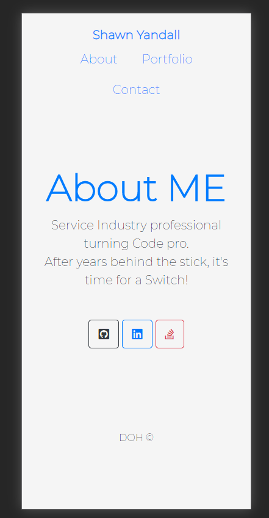
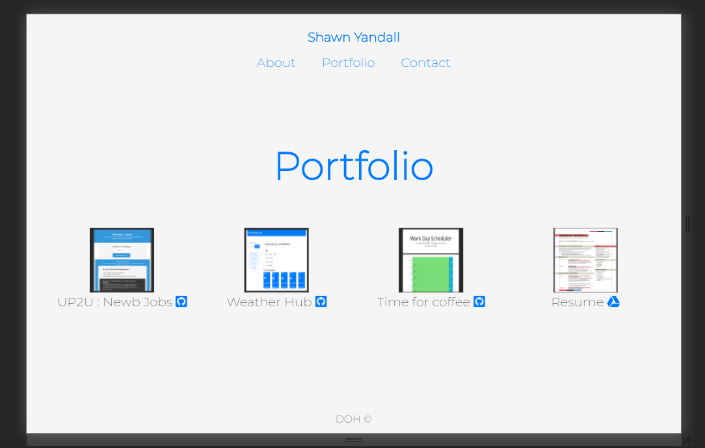
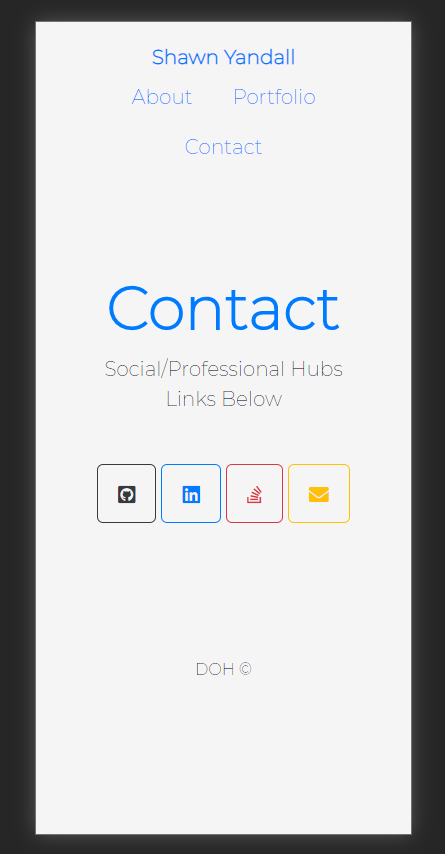

# Entry_Level
Repo for Self-Depot

# Repo and Deploy
  Website is deployed via [gitHub](https://dohmr.github.io/Entry_Level/).
  Repository can be found..[here](https://github.com/dohmr/Entry_Level)
    
# Usage is **simple**.
  Navbar is located ontop, and there are _3_ options of 
   #### About | Portfolio | Contact
    About contains a brief bio, as well as links to appropriate social media.
    Portfolio contains projects, personal and group, as well as a resume.
    Contact will give the user the ability to reach me, via email, linkedIn, gitHub, etc...
    The name at the top is *also* an email prompt.
    Images are within the /Portfolio folder within the repository.
    
    The repository holds each page of HTML, as well as a small amount of css.
    The layout was created using the Bootstrap framework.
 
# Creation 
This layout and website was created by myself, with the guidance of my instructor, assistance from my T.A., and helpful questions from my peers.
    Many credits go to sites w3schools, stack overflow, and bootstrap.
    
    
    As of 09/28 an update/upgrade has occurred. A change in layout design and portfolio update!
    Site contains HTML / CSS while using Bootstrap framework.
    
# Screens
Landing page; About Me:

;

Portfolio page:

;

Contact page:

;
    
